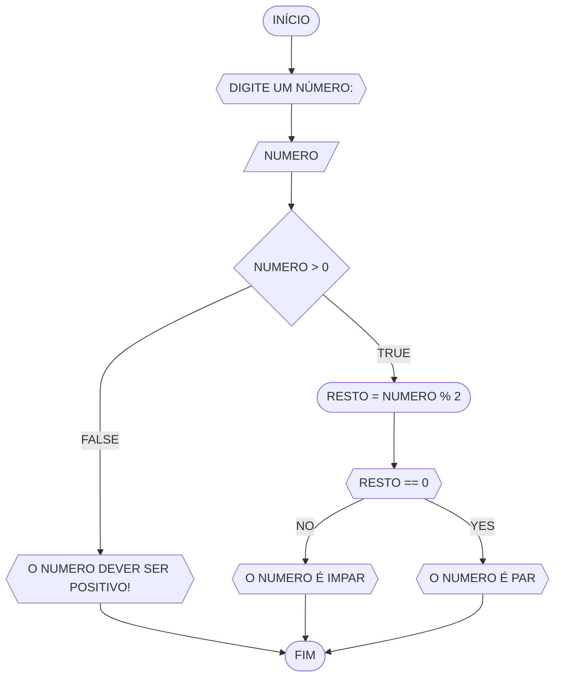

# **UNIFOR**
>**Disciplina**: Raciocínio logico algorítmico <br>
>**Orientador**: Prof. Ricardo Carubbi

## **Lista 1 Exercícios**
### Exercício 3
Represente, em fluxograma e pseudocódigo, um algoritmo para determinar se um número inteiro e positivo é par ou impar

#### Fluxograma



```
ALGORITIMO verificar_par_ou_impar
DECLARE numero, resto INTEIRO
ESCREVA "Digite um numero"
LEIA numero 
SE numero >= 0 EANTAO
	resto = numero % 2 
	SE resto == 0 ENATO 
		ESCREVA "O numero é par!"
	SENAO 
		ESCREVA "O numero é impar!"
SENAO
	ESCREVA "O número deve ser positivo"
FIM_ALGORITIMO
```

